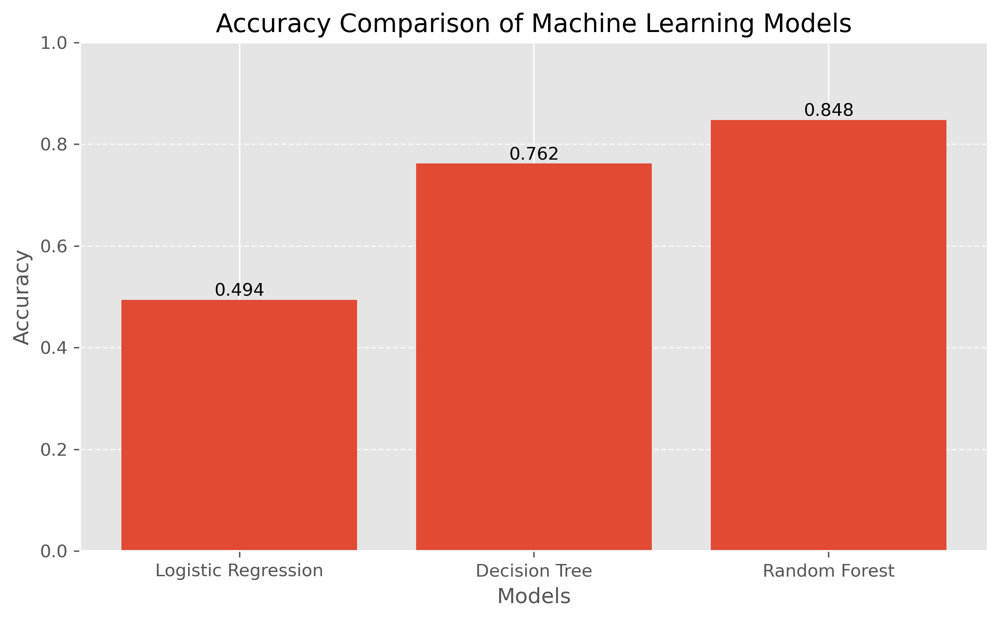
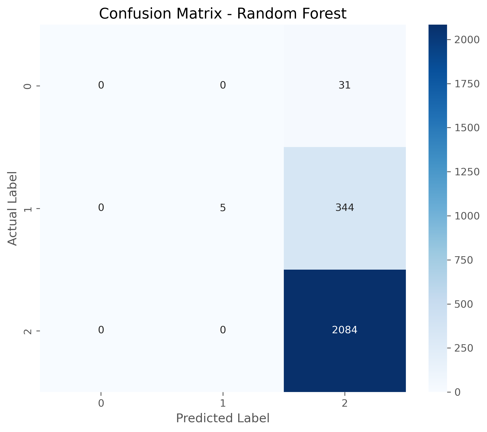
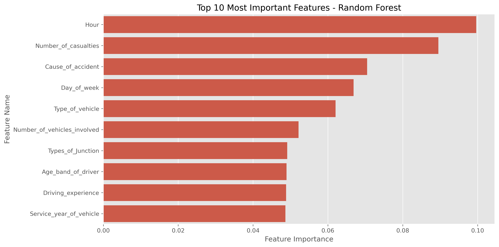

# 🚦 Road Accident Severity Prediction using Machine Learning

## 📌 Project Overview

This project predicts the severity of road traffic accidents using Machine Learning techniques. The model analyses accident-related information such as road conditions, weather, vehicle type, collision details, and driver information to classify accident severity.

The project includes complete data preprocessing, exploratory data analysis (EDA), feature engineering, model training, evaluation, feature importance analysis, and model saving.

---

## 🎯 Objectives

* Analyse road accident data.
* Perform data cleaning and preprocessing.
* Visualise accident patterns.
* Train multiple Machine Learning models.
* Compare model performance.
* Predict accident severity accurately.

---

## 🛠 Technologies Used

* Python
* Jupyter Notebook
* NumPy
* Pandas
* Matplotlib
* Seaborn
* Scikit-learn
* Joblib

---

## 📂 Dataset

**Dataset:** RTA Dataset.csv

The dataset contains various factors related to road accidents including:

* Driver information
* Vehicle type
* Road condition
* Weather condition
* Collision type
* Time of accident
* Road surface
* Casualties
* Accident severity

---

## 📊 Machine Learning Workflow

1. Data Collection
2. Data Cleaning
3. Exploratory Data Analysis (EDA)
4. Feature Engineering
5. Data Preprocessing
6. Train-Test Split
7. Model Training
8. Model Evaluation
9. Feature Importance Analysis
10. Model Saving

---

## 🤖 Machine Learning Algorithms

* Logistic Regression
* Decision Tree Classifier
* Random Forest Classifier

---

## 📈 Model Evaluation

The project evaluates models using:

* Accuracy Score
* Confusion Matrix
* Classification Report
* Feature Importance

---

## 📷 Project Results

### Accuracy Comparison



---

### Confusion Matrix



---

### Feature Importance



---

## 📁 Project Structure

```
Road-Accident-Severity-Prediction/
│
├── Road_Accident_Severity_Prediction.ipynb
├── RTA Dataset.csv
├── README.md
├── requirements.txt
├── LICENSE
├── .gitignore
├── images/
│   ├── accuracy_comparison.png
│   ├── confusion_matrix.png
│   └── feature_importance.png
└── model/
    ├── random_forest_model.pkl
    └── label_encoder.pkl
```

---

## 🚀 Installation

Clone the repository

```bash
git clone https://github.com/Neha1016/Machine-Learning-Projects.git
```

Install the required libraries

```bash
pip install -r requirements.txt
```

Open the notebook

```bash
jupyter notebook
```

---

## 🔮 Future Improvements

* Hyperparameter tuning
* Deep Learning model
* Flask deployment
* Streamlit web application
* Real-time accident prediction API

---

## 👩‍💻 Author

**Neha Chouhan**

B.Tech (Artificial Intelligence)

GitHub: https://github.com/Neha1016

LinkedIn: https://www.linkedin.com/in/neha-chouhan-n3399/

---

## ⭐ If you found this project useful, consider giving it a Star.
